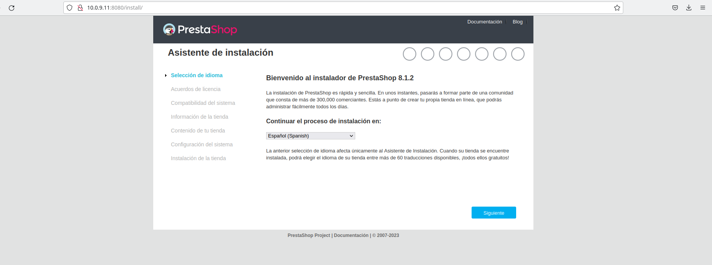
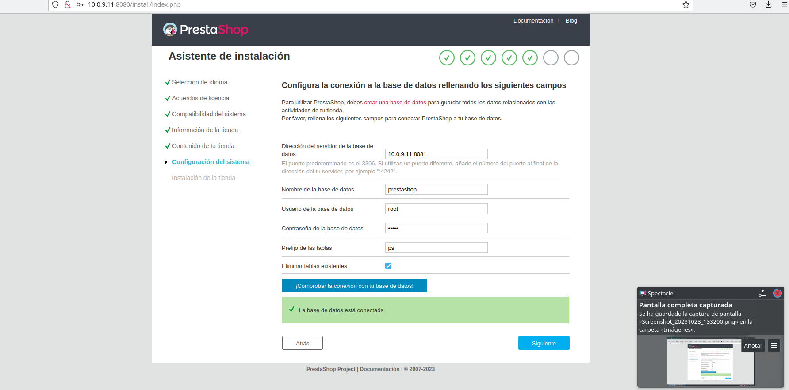
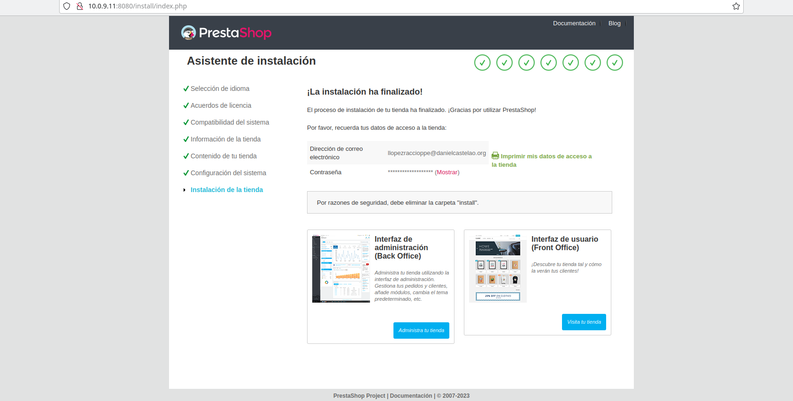
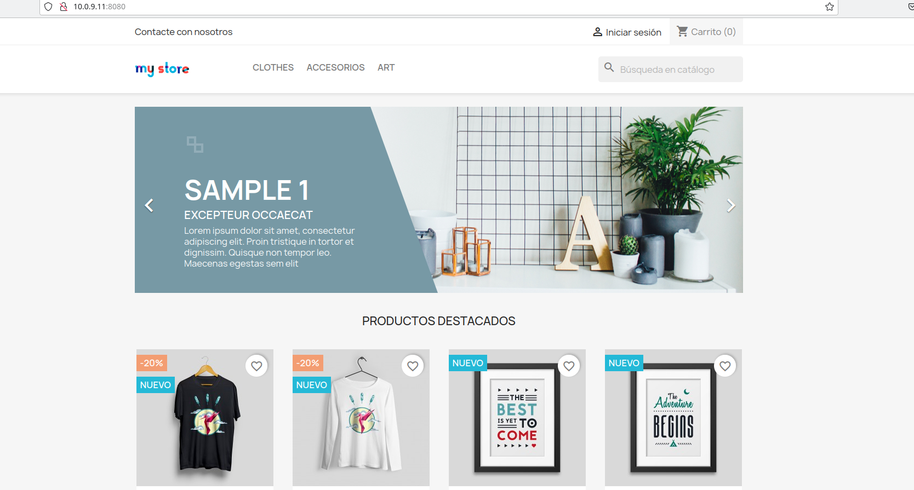

# Leanme Compose

## Para Establecer el Compose prestashop
Se debe crear un archivo con el nombre `docker-compose.yml`, para una instalacion rapida
y simple para el uso y disfrute del `prestashop`.
## Explicando el Compose prestashop
Los modificadores `env` o `enviroment` son para indicar que es 
una *variable de entorno*, estas son variables de la propia imagen ya sea 
un  `BASEDATOS_USER`, para establecer el usuario de la base de datos, 
`BASEDATOS_PASSWORD`, para establecer la contraseña de usuario inicial, entre 
otras más, el modificador `images` es para el indicar que servicio usaremos así 
como su *versión*,  siendo la última indicada por la etiqueta o *TAG*, esta 
información se puede encontrar en su página de docker hub.

El modificador `volumes` es para indicar donde debe de *guardar y cargar* la 
información que se haga con el contenedor que se le indique, otro sería `ports` 
siendo estos para indicar que *puerto de la máquina nativa* debe de enlazarse con 
que *puerto del contenedor* que se le indique, en ese orden.

Otros modificadores son `networks` que son utilizados para permitir 
la *comunicación más fácil * entre los distintos *contenedores* que 
se encuentren en el compose. En este caso se debe de establacer una `networks` de orden superior y luego hacer que esta sea referenciada dentro de los contenedores donde se necesite.

Tambien esta el modificador `depends_on` que establecen un orden en el que se iniciaran los contenedores, para asi evitar que
el contenedor de `prestashop` se inicie antes que el de `mysql`, lo que daria error al no estar el primero ejecutandose

Luego solo se tiene que levantar el propio compose, con el 
comando `docker compose up -d`

### Dentro de prestashop

Para ingresar se debe de poner la `ip de la maquina` y luego seguido de `:` el `puerto 
que se puso como nativo` en el docker compose, todo esto en algun navegador avanzado

Una vez dentro solo se tiene que seguir los formularios de la propia prestashop 
donde al momento de como se ve en la imagen 2 se deben de introducir **los datos** que se pusieron en el `compose`

mi tienda tiene de contraseña : contraseñadetienda

